# План реализации сайта stroykomplektremont.ru на Astro

**Дата:** 2026-08-05
**Тип:** Гибрид (одностраничный лендинг + отдельные страницы портфолио и контактов)
**Платформа:** Astro (SSG)
**Источники контента:** stroykomplektremont.ru (WordPress), объявление Avito

---

## Архитектура сайта (Mermaid)

```mermaid
graph TD
    A[Layout.astro - Общий макет] --> B[index.astro - Главная]
    A --> C[portfolio.astro - Портфолио]
    A --> D[contacts.astro - Контакты]
    A --> E[privacy-policy.astro]
    A --> F[404.astro]

    B --> B1[HeroSection]
    B --> B2[ServicesCarousel]
    B --> B3[PricingTariffsSection - NEW]
    B --> B4[ProcessStepsSection - NEW]
    B --> B5[AdvantagesSection - NEW]
    B --> B6[CaseStudiesSection]
    B --> B7[VideoTestimonialsSection - NEW]
    B --> B8[FaqSection]
    B --> B9[ContactInfoSection - NEW]
    B --> B10[CTASection - NEW]

    C --> C1[PortfolioGrid - NEW]
    C --> C2[PortfolioFilter - NEW]

    D --> D1[ContactInfo]
    D --> D2[YandexMap]
    D --> D3[SocialLinks]

    A --> A1[HeaderMain]
    A --> A2[FooterMain]
    A --> A3[DialogModal - Форма заявки]
```

---

## Этап 1: Обновление данных (JSON-файлы)

### 1.1 `src/data/global_settings.json` — Глобальные настройки

Обновить:

- `title`: "Строй Комплект Ремонт — ремонт квартир и домов под ключ в Москве"
- `description`: SEO-описание
- `base_url`: "https://stroykomplektremont.ru"
- `theme_color`: оставить `#18181b`
- `variables.phone`: "79296515131" (уже корректный)
- `dialogModal`: обновить тексты
- `social_links`: добавить Telegram, WhatsApp, VK, YouTube, Instagram, RuTube с актуальными ссылками

### 1.2 `src/data/home.json` — Главная страница

Обновить все поля на русские тексты из источника:

- `hero_title`: "Ремонт квартир и домов под ключ в Москве и МО"
- `hero_content`: актуальный подзаголовок
- `services_title`: "Наши услуги"
- `case_studies_title`: "Примеры работ" (уже есть)
- `quote_content`: заменить на реальный отзыв
- `faq_title`: "Ответы на вопросы" (уже есть)
- Добавить: `tariffs_title`, `process_title`, `advantages_title`, `testimonials_title`, `contacts_title`

### 1.3 `src/data/services.json` — Услуги

Заменить английские тексты на реальные услуги:

- Косметический ремонт квартир и домов
- Капитальный ремонт квартир и домов
- Ремонт под ключ
- Дизайнерский ремонт
- Премиальный ремонт
- Ремонт в новостройке / во вторичке

**Перечень работ по капитальному ремонту (из Avito):**
Перепланировка, возведение перегородок, стяжка пола, оштукатуривание стен и потолков, шпатлевание, прокладка/замена электрики, установка/замена водоснабжения, канализации и отопления, монтаж окон, установка входной двери.

**Перечень работ по косметическому ремонту:**
Отделка потолка, натяжной потолок, оклейка стен обоями/покраска, укладка напольного покрытия, укладка плитки, установка сантехники, межкомнатных дверей, розеток и выключателей, осветительных приборов.

**Ключевые условия:**

- Минимальный объём: квартира — 40 м², дом — 100 м²
- Работа по готовому дизайн-проекту: да
- Бесплатный выезд на замер: да
- Оплата: поэтапная, по договору
- Гарантия: до 3 лет
- Мастеров: 5–20 человек
- Опыт: 10+ лет
- График: Пн-Вс, 08:00–22:00
- Проживание на объекте: не требуется
- Исполнитель закупает материалы: да

### 1.4 `src/data/pricing.json` — Тарифы и цены

Актуальные цены из Avito (цена за м² работ, без материалов если не указано иное):

- **Косметический ремонт** — от 20 000 ₽/м²
  (демонтаж покрытий, поклейка обоев, окраска потолков, укладка ламината, монтаж плинтусов)
- **Капитальный ремонт** — от 25 000 ₽/м²
  (демонтаж, выравнивание пола, частичная штукатурка стен, грунтовка, шпаклевка, поклейка обоев, окраска потолков, укладка ламината, монтаж плинтусов)
- **Ремонт под ключ** — от 25 000 ₽/м² ⭐ (все материалы включены)
- **Дизайнерский ремонт** — от 35 000 ₽/м²
- **Премиальный ремонт** — от 50 000 ₽/м²
- **Ремонт в новостройке** — от 25 000 ₽/м²
- **Ремонт во вторичке** — от 30 000 ₽/м²

**Условия:**

- Минимальная сумма заказа: 500 000 ₽
- Минимальный объём: квартира — 40 м², дом — 100 м²
- Оплата: поэтапная, работа по договору
- Гарантия: до 3 лет

### 1.5 `src/data/case_studies.json` — Кейсы

Заменить на реальные проекты (3+):

- Квартира 85 м², ЖК "Сколково"
- Квартира 125 м², ЖК "Сердце Столицы"
- Загородный дом 830 м², КП "Монтевиль"

### 1.6 `src/data/faq.json` — FAQ

Уже содержит реальные вопросы на русском (6 вопросов). Проверить и дополнить при необходимости.

### 1.7 `src/data/testimonials.json` — Отзывы

Заменить английские на реальные русские отзывы клиентов.

### 1.8 Новые JSON-файлы

- **`src/data/process.json`** — Этапы работы (6 шагов)
- **`src/data/advantages.json`** — Преимущества/гарантии (6 блоков)
- **`src/data/portfolio.json`** — Портфолио проектов (для страницы портфолио)
- **`src/data/contacts.json`** — Детальные контакты

---

## Этап 2: Доработка главной страницы

### Существующие секции (требуют обновления данных):

- HeroSection ✅ (обновить тексты)
- ServicesCarousel ✅ (обновить услуги)
- CaseStudiesSection ✅ (обновить кейсы)
- FaqSection ✅ (уже на русском)
- QuoteSection ✅ (заменить на реальный отзыв)

### Новые секции (требуют создания):

#### 2.1 `PricingTariffsSection.astro` — Тарифы

- 4 карточки тарифов: Стандарт, Комфорт, Бизнес, Премиум
- Выделить "Комфорт" как самый популярный
- Кнопка CTA "Заказать" на каждой карточке

#### 2.2 `ProcessStepsSection.astro` — Этапы работы

- 6 шагов: Заявка → Замер → Смета → Договор → Ремонт → Сдача
- Визуализация с иконками/цифрами

#### 2.3 `AdvantagesSection.astro` — Преимущества/Гарантии

- 6 блоков: Договор, Оплата по этапам, Гарантия до 3 лет, Контроль качества, Соблюдение сроков, Точная смета
- Сетка 3×2

#### 2.4 `VideoTestimonialsSection.astro` — Видеоотзывы

- 3 видеоотзыва с YouTube/VK
- Возможность воспроизведения

#### 2.5 `ContactInfoSection.astro` — Контакты на главной

- Телефон, адрес, режим работы
- Карта (статическое изображение)

#### 2.6 `CTASection.astro` — Финальный CTA-блок

- "Готовы обсудить ваш ремонт?"
- Кнопка вызова модального окна с формой

### Удаляемые секции (не нужны для сайта ремонтной компании):

- `ClientsSection.astro` — заменить на AdvantagesSection
- `PricingSection.astro` — заменить на PricingTariffsSection
- `TestimonialsSection.astro` — заменить на VideoTestimonialsSection
- `NewsletterSection.astro` — удалить

---

## Этап 3: Страница портфолио

### 3.1 `src/pages/portfolio.astro`

- Заголовок "Наши работы"
- Фильтр по типу объекта (квартиры, дома, коммерция)
- Сетка проектов (Masonry или Grid)

### 3.2 `PortfolioGrid.astro`

- Карточка проекта: фото, название, метраж, сроки, бюджет
- Лайтбокс для просмотра фото

---

## Этап 4: Страница контактов

### 4.1 `src/pages/contacts.astro`

- Заголовок "Контакты"
- Контактная информация: телефон, email, адрес, режим работы
- Социальные сети и мессенджеры: Telegram, WhatsApp, VK, YouTube, Instagram, RuTube
- Форма обратной связи
- Карта Яндекс (ленивая загрузка)

### 4.2 `ContactInfo.astro`

- Блок с полной контактной информацией
- Иконки для каждого типа связи

### 4.3 `YandexMap.astro`

- Ленивая загрузка Яндекс.Карт
- Метка на адресе: г. Москва, ул. Народного Ополчения, д. 5, корп. 2

---

## Этап 5: Шапка и подвал

### 5.1 `HeaderMain.astro` — доработки

- 🔧 Добавить телефон в шапку: `+7 (929) 651-51-31`
- 🔧 Обновить лого (уже есть `logo.svg`)
- 🔧 Навигация: Услуги, Цены, Портфолио, Отзывы, FAQ, Контакты
- 🔧 Мобильное меню (бургер)

### 5.2 `FooterMain.astro` — доработки

- 🔧 Копирайт: "СтройКомплектРемонт © 2025" (уже есть)
- 🔧 Ссылка на политику конфиденциальности
- 🔧 Социальные сети (уже есть)
- 🔧 Добавить телефон и email

---

## Этап 6: Доработка формы заявки (`ReactModal.tsx`)

### Текущее состояние:

- 2 поля: Имя, Телефон
- Отправка в Google Sheets → Telegram (работает)

### Необходимые доработки:

- 🔧 Добавить поле "Тип объекта" (выпадающий список: Новостройка, Вторичка, Дом, Коммерция, Не уверен)
- 🔧 Добавить поле "Площадь (м²)" (числовое)
- 🔧 Добавить поле "Комментарий" (textarea, необязательное)
- 🔧 Маска телефона (+7 XXX XXX-XX-XX)
- 🔧 Передавать новые поля в `formData` при отправке

---

## Этап 7: SEO и мета-теги

- 🔧 `title` и `description` для каждой страницы
- 🔧 `og:title`, `og:description`, `og:image` (уже частично есть в Layout)
- 🔧 JSON-LD разметка (Organization, LocalBusiness)
- 🔧 Sitemap (через `@astrojs/sitemap`)
- 🔧 `robots.txt`
- 🔧 Фавикон (уже есть)
- 🔧 Alt-тексты для всех изображений
- 🔧 Канонические URL

---

## Этап 8: Финальная проверка

- 🔧 Валидация HTML
- 🔧 Lighthouse audit (Performance, Accessibility, SEO)
- 🔧 Адаптивность (мобильные, планшеты, десктоп)
- 🔧 Кроссбраузерность
- 🔧 Проверка работоспособности формы заявки
- 🔧 Проверка всех ссылок
- 🔧 Оптимизация изображений (AVIF/WebP через @astrojs/image)

---

## Сводка: что уже готово vs что нужно сделать

| Компонент                      | Статус                                |
| ------------------------------ | ------------------------------------- |
| Layout.astro                   | ✅ Готово, требует мелких правок      |
| HeaderMain.astro               | ⚠️ Добавить телефон и мобильное меню  |
| FooterMain.astro               | ⚠️ Добавить телефон и email           |
| HeroSection.astro              | ⚠️ Обновить тексты, убрать скриншоты  |
| ServicesCarousel.astro         | ⚠️ Заменить контент на услуги ремонта |
| DialogModal.astro              | ✅ Готово                             |
| ReactModal.tsx                 | 🔴 Добавить 3 новых поля              |
| CaseStudiesSection.astro       | ✅ Готово, обновить данные            |
| FaqSection.astro               | ✅ Готово                             |
| QuoteSection.astro             | ⚠️ Заменить на реальный отзыв         |
| PricingTariffsSection.astro    | 🔴 Создать с нуля                     |
| ProcessStepsSection.astro      | 🔴 Создать с нуля                     |
| AdvantagesSection.astro        | 🔴 Создать с нуля                     |
| VideoTestimonialsSection.astro | 🔴 Создать с нуля                     |
| ContactInfoSection.astro       | 🔴 Создать с нуля                     |
| CTASection.astro               | 🔴 Создать с нуля                     |
| PortfolioGrid.astro            | 🔴 Создать с нуля                     |
| YandexMap.astro                | 🔴 Создать с нуля                     |
| index.astro                    | ⚠️ Пересобрать секции                 |
| portfolio.astro                | 🔴 Создать с нуля                     |
| contacts.astro                 | 🔴 Создать с нуля                     |
| privacy-policy.astro           | 🔴 Создать с нуля                     |
| 404.astro                      | 🔴 Создать с нуля                     |
| Все JSON-данные                | ⚠️ Заменить на реальный контент       |

---

## Порядок реализации

1. **Обновить все JSON-данные** (контент — основа всего)
2. **Создать новые компоненты** (PricingTariffsSection, ProcessStepsSection, AdvantagesSection, VideoTestimonialsSection, ContactInfoSection, CTASection)
3. **Пересобрать главную страницу** (обновить index.astro с новыми секциями)
4. **Доработать форму заявки** (ReactModal.tsx — новые поля)
5. **Создать страницу портфолио** (portfolio.astro + PortfolioGrid)
6. **Создать страницу контактов** (contacts.astro + YandexMap)
7. **Доработать шапку и подвал** (телефон, мобильное меню)
8. **SEO** (мета-теги, JSON-LD, sitemap)
9. **Финальная проверка и оптимизация**
